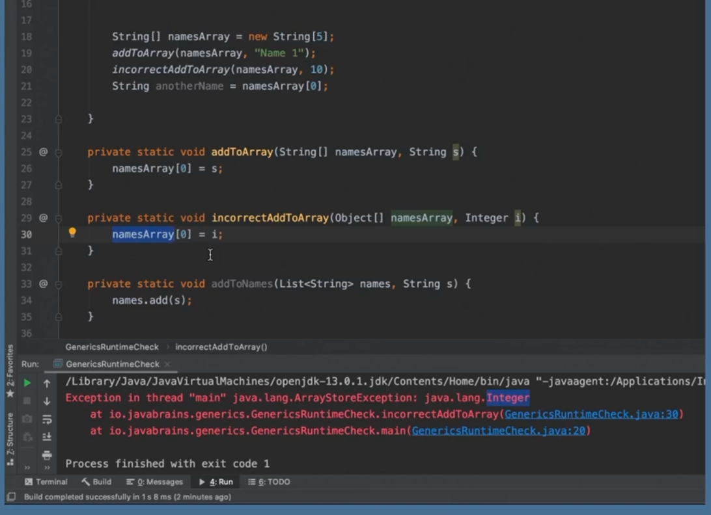
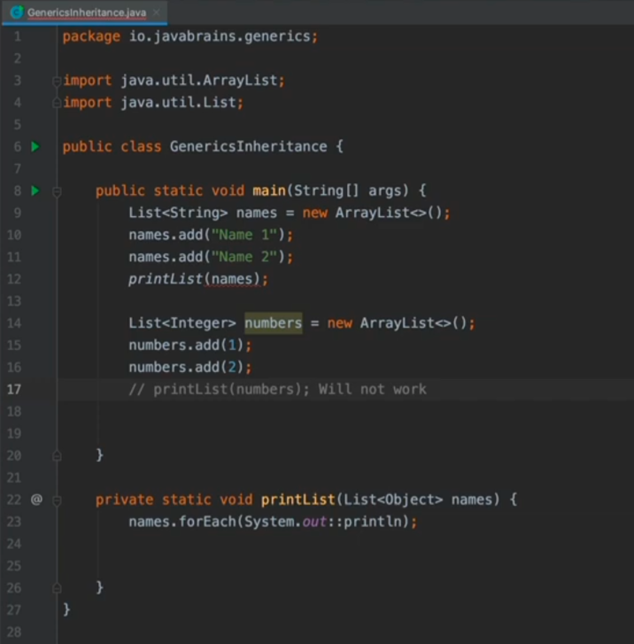

# Java Brains - Generics In Depth 

## Introduction 


## Why we need Generics ? 
The below will not work without casting!


***

***


## Type Erasure

- Generic is not a Runtime construct, it's actually a compile time construct. 
- This is called Type erasure. 
- Generic is a compile type construct because, after compiling the byte code will not have the generic information at all!
<br></br>


## Generics vs Typed Arrays 

- We were able to add a different type in case of Generics, but that's not possible in case of Arrays.
- Thus, Generics is a compile time construct, whereas the arrays is a runtime construct. 
<br></br>


## Inheritance with generics 


## Generics Upper Bound 

- ```<? extends Number>``` This means it can be of any type which extends Number class.

## Using wild cards example 

- ```<E extends Animal>``` The advantage of using this is, you can't create a cage of String which doesn't make sense
- ```<E extends Animal>``` Also, without this in compatible function, you can't compare. 


