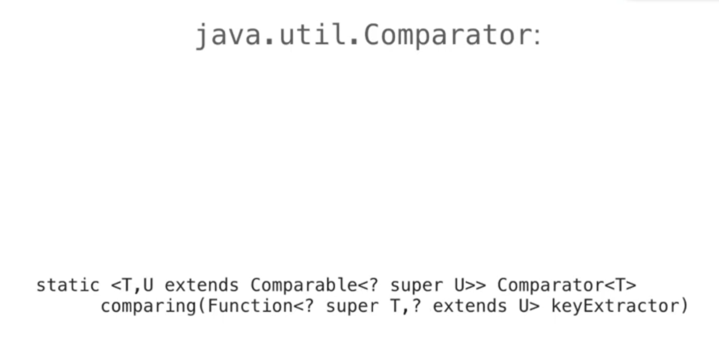
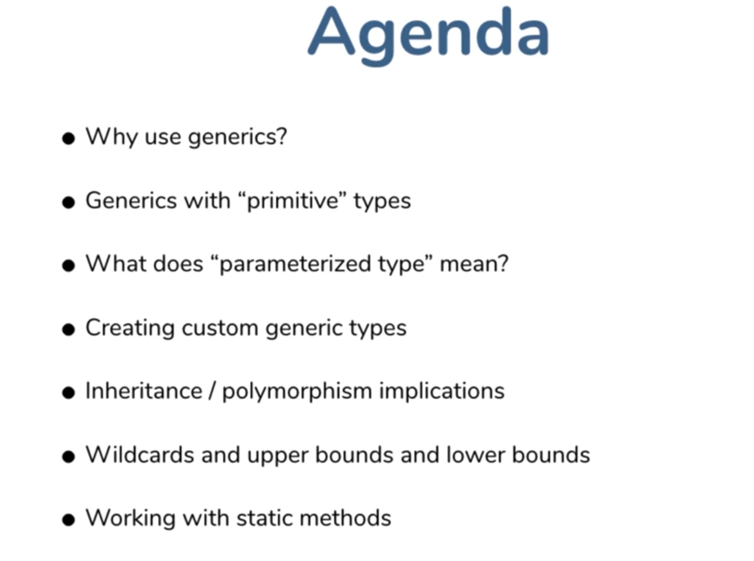
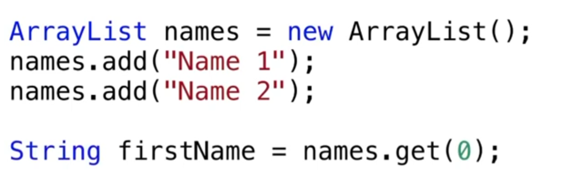
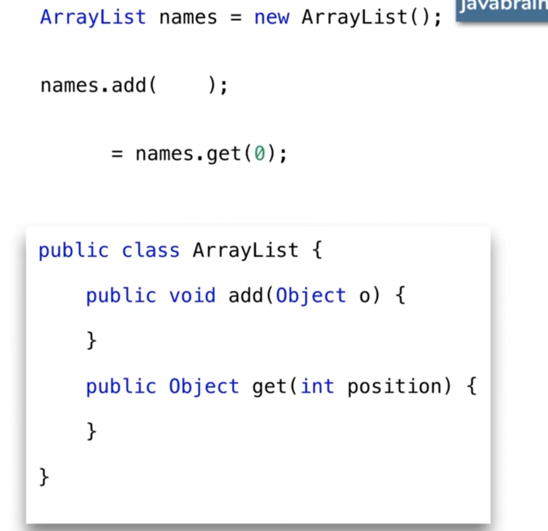
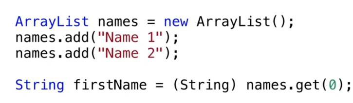
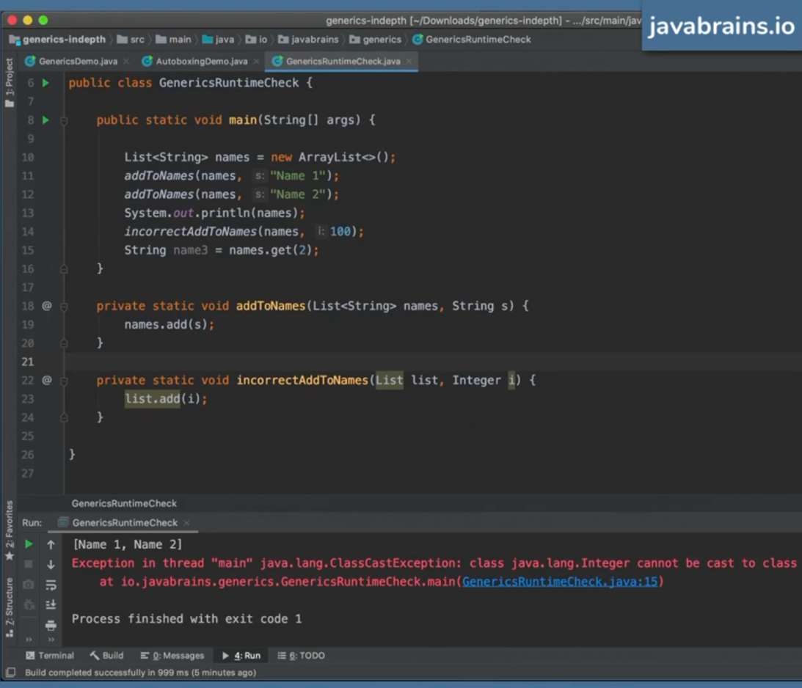

# Java Brains - Generics In Depth 

## Introduction 

## Why we need Generics ? 
The below will not work without casting!

***

***

## Type Erasure

- Generic is not a Runtime construct, it's actually a compile time construct. 
- This is called Type erasure. 
- Generic is a compile type construct because, after compiling the byte code will not have the generic information at all!
  

